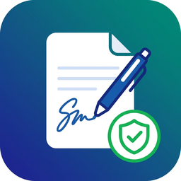

# SignPDF — Firma Digital de Documentos PDF en Linux

<p align="center">
  
</p>

<p align="center">
  <strong>Aplicación de escritorio para firmar documentos PDF con certificados digitales.</strong><br>
  Compatible con PAdES (ETSI.CAdES.detached) — Legalmente válido en la UE bajo eIDAS.
</p>

---

## ✨ Características

- 🔐 **Firma digital PAdES** — Estándar europeo, compatible con Adobe Acrobat Reader
- 📄 **Visor PDF integrado** — Visualiza y navega documentos sin salir de la app
- 📍 **Colocación precisa** — Arrastra un rectángulo para posicionar la firma exactamente donde quieras
- 🎨 **Personalizable** — Elige el color del borde de la firma (rojo, azul, verde, negro, morado, gris)
- 🖊️ **Firma profesional** — Estilo Adobe con nombre, fecha, motivo y ubicación
- 💾 **Persistencia** — Tu certificado se guarda automáticamente entre sesiones
- 📱 **Responsivo** — La firma se adapta al tamaño del rectángulo que dibujes
- 🔒 **Semi-transparente** — La firma no oculta el contenido del documento

## 🏛️ Certificados Compatibles

| Entidad | Tipo |
|---------|------|
| **FNMT** | Fábrica Nacional de Moneda y Timbre |
| **DNIe** | Documento Nacional de Identidad electrónico |
| **DigiCert** | Certificados comerciales |
| **GlobalSign** | Certificados comerciales |
| **Comodo/Sectigo** | Certificados comerciales |
| **Cualquier PKCS#12** | Archivos `.p12` / `.pfx` |

## 📦 Instalación

### Desde .deb (Debian/Ubuntu)

```bash
sudo dpkg -i signpdf_1.0.0_amd64.deb
```

### Desde código fuente

```bash
git clone git@github.com:hectornav/pdfsigner.git
cd pdfsigner
npm install
npm run dev
```

### Construir paquetes

```bash
# .deb
npm run package:deb

# AppImage
npm run package:appimage

# RPM
npm run package:rpm

# Todos
npm run package:all
```

## 🚀 Uso

1. **Abrir PDF** — Arrastra un archivo o usa el botón "Abrir PDF"
2. **Cargar certificado** — Selecciona tu archivo `.p12` / `.pfx` e introduce la contraseña
3. **Firmar** — Pulsa "Firmar PDF" y arrastra un rectángulo en la zona deseada
4. **Personalizar** — Elige el color del borde, razón, ubicación y email
5. **Confirmar** — Pulsa "Firmar Documento" y guarda el PDF firmado

## 🛠️ Tecnologías

- **Electron** — Framework de escritorio multiplataforma
- **pdf-lib** — Manipulación de PDFs y firma visual
- **PDF.js** — Renderizado de PDFs (Mozilla)
- **node-forge** — Criptografía y manejo de certificados PKCS#12
- **@signpdf** — Firma PAdES estándar

## 📋 Requisitos del sistema

- **Linux** — Ubuntu 20.04+, Debian 11+, Fedora 34+
- **Node.js** — v18+ (solo para desarrollo)
- **Certificado digital** — Formato PKCS#12 (.p12 / .pfx)

## 📄 Licencia

MIT License — Ver [LICENSE](LICENSE) para más detalles.

---

<p align="center">
  Desarrollado por <strong>Héctor Navarro</strong>
</p>
